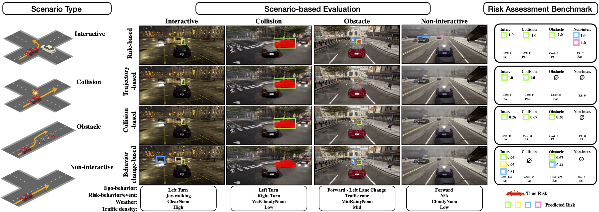

# RiskBench: A Scenario-based Risk Assessment Benchmark
This is an anonymous repo for submission.
PyTorch code for RiskBench.


## System requirements
- Linux (Tested on Ubuntu 18.04)
- Python3 (Tested using Python 3.7)
- PyTorch (Tested using PyTorch 1.10.0)
- CUDA (Tested using CUDA 11.3)
- CARLA (Tested using CARLA 0.9.13)
- GPU ( Tested using Nvidia rtx3090)

## Installation
1. Download CARLA from https://drive.google.com/file/d/1bQE3H4mh2WBSGK8tZ4UzTfogce-5HcEJ/view?usp=share_link
2. Unzip CARLA.zip
3. install the conda environment following below steps

```bash
# create conda environment 
conda create -n carla python=3.7

# instal pytorch 
conda install pytorch==1.10.0 torchvision==0.11.0 torchaudio==0.10.0 cudatoolkit=11.3 -c pytorch -c conda-forge

# install detectron2 from 
# https://detectron2.readthedocs.io/en/latest/tutorials/install.html
python -m pip install detectron2 -f \
  https://dl.fbaipublicfiles.com/detectron2/wheels/cu113/torch1.10/index.html
  
# install pytorch lighting 
pip install pytorch-lightning==0.8.5
pip uninstall setuptools
pip install setuptools==59.5.0

# install opencv
pip install opencv-python

# others
pip install timm
pip install wandb
pip install imgaug
pip install pandas
pip install pygame
pip insall gdwon
pip install attrdict

# install carla 
cd path_to_carla/PythonAPI/dist/
pip install carla-0.9.13-cp37-cp37m-linux_x86_64.whl

# install roi align
# You need to install cudnn on root ( outside the conda environment  )
cd ~/planning_aware_eval/interactive/roi_two_stage/models/roi_align/
python setup.py install

```


## Dataset
We currently provide sample data for testing. The full dataset will be released soon.

## Code execution

### Risk Assessment Prediction (optional)
We provided risk assessment prediction results preserved in json format for each algorithm. Alternatively, one can generate by following the instruction in [risk_assessment/models](https://github.com/HCIS-Lab/RiskBench/tree/main/risk_assessment/models). We will release a intergrated API soon!

### Offline Risk Assessment Evaluation
We perform offline risk assessment evaluation (with metric F-1 score and PIC) by taking input as preserved risk assessment prediction:
```
python risk_assessment_identification.py --path {PREDICTION_PATH} --model {MODEL} --metric {METRIC} --scenario {ATTRIBUTE}
```

Arguments: 

| Parameter     | Description                                          |  Example   |
| :------------ | :--------------------------------------------------- | :--------: |
| --path        | path of the stored prediction .json file             | prediction |
| --model       | name of the risk assessment method                   | two-stage  |
| --metric      | risk assessment metric                               |     F1     |
| --scenario    | scenario filter, default is ""                       |    Rain    |
| --save_result | save result to {PREDICTION_PATH}/result/{MODEL}.json |    None    |


### Planning-aware Risk Assessment

Planning-aware risk assessment evaluation takes place in CARLA simulaotr. We provide the materials (vehicle's control and random seed) to reproduce all testing scenarios.

step 1: move the recorded scenarios to the CARLA folder
```
cd planning_aware_eval/
mv -r interactive/ path_to_carla/PythonAPI/
mv -r obstacle/ path_to_carla/PythonAPI/
```

setp 2: execute planning-aware risk assessment evaluation
```
# For interactive scenario
bash test_interactive.sh

# For obstacle scenario
bash test_obstacle.sh
```
User can select the algorithm to be evaluated in the process.

The evaluation for each algorithm take about 4 hours.

The testing results will be save to results/. 

To obtain the Influenced ratio and Collision rate, run the command:
```
python data_analysis.py
```
